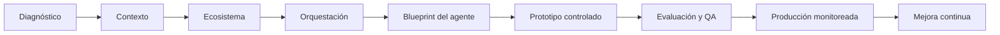

# Flujo Visual CEO

## Vista general

## Lectura consultiva

El método avanza de la pregunta de negocio hacia la operación real.

Primero se identifica el problema, después se define qué debe entender el agente, luego se mapea dónde vivirá y finalmente se diseña cómo se coordinará con herramientas, humanos y otros agentes.

## Flujo por etapa

| Etapa | Pregunta principal | Documento |
| --- | --- | --- |
| Diagnóstico | Qué problema vale la pena resolver | Diagnóstico del Cliente |
| Contexto | Qué debe entender el agente | Framework CEO / Blueprint |
| Ecosistema | Dónde opera y con qué se conecta | Mapa de Ecosistema |
| Orquestación | Cómo se coordina la acción | Orquestación de Agentes |
| Blueprint | Qué se va a construir exactamente | Blueprint del Agente |
| Prototipo | Cómo se prueba sin riesgo | Plan de Implementación |
| QA | Cómo sabemos que funciona | Evaluación y QA |
| Producción | Cómo se lanza con control | Checklist de Producción |
| Mejora | Cómo se mantiene útil | Gobierno y Mejora Continua |

## Frase de presentación

Nuestro proceso no empieza construyendo un bot. Empieza entendiendo el contexto, mapeando el ecosistema y diseñando la orquestación necesaria para que el agente produzca resultados reales con control operativo.

